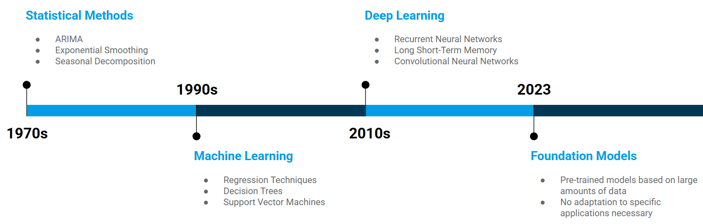
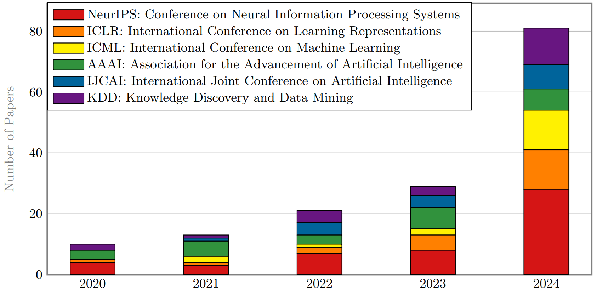

# Foundation Models for Time Series Forecasting: A Practitioner's Guide

Time Series Forecasting (TSF) is a fundamental task that underpins strategic decision-making in countless industries, from energy and logistics to finance. The methodology in this field has evolved rapidly, moving from classical statistical models to a new, groundbreaking paradigm—**Foundation Models (FMs)**.

These models, pre-trained on vast and diverse datasets, have already achieved impressive success in other sequence-based domains like Natural Language Processing (NLP). Their great promise for TSF is the capability for **generalization**: a single, pre-trained model that can deliver robust forecasts for a wide variety of time series without needing a new model to be designed and trained from scratch for each specific task (zero-shot or few-shot learning). This promises to significantly simplify traditional, often labor-intensive forecasting pipelines that require deep expert knowledge and extensive feature engineering.

As research in this area progresses at a breakneck pace, the landscape of available models, architectures, and benchmarks can quickly become overwhelming. The chart below illustrates the dramatic increase in TSF-related publications at top-tier AI and Machine Learning conferences in just the last few years.

*Source: [Kim et al., Oct. 2024. "A comprehensive survey of deep learning for time series forecasting"](https://arxiv.org/abs/2410.13404)

**The goal of this document is to provide a clear guide.** Based on a comprehensive analysis and empirical benchmarks, this guide aims to:
1.  Provide a clear overview of the **current strategies and core concepts** behind Foundation Models for TSF.
2.  Highlight practical **resources and benchmarks** for your own research and development.
3.  Offer a curated overview of **selected Foundation Models**, detailing their respective strengths, weaknesses, and architectural approaches.

This guide is intended for anyone with a basic understanding of forecasting and deep learning who wants to understand the current state of the art and how to leverage Foundation Models for their own forecasting tasks.

---

## 🎓 Recommendation for the Basics

This document assumes a foundational knowledge of time series analysis and forecasting. For anyone looking for an excellent and practical introduction to the entire topic, I highly recommend the following tutorial by Dr. Christoph Bergmeir.

**[Tutorial: Forecasting for Data Scientists](https://cbergmeir.com/talks/acml-tutorial/)** (YouTube, approx. 2.5 hours)

---

## 🧠 Core Concepts

### Primary Strategies for Time Series FMs

The development of Foundation Models for time series can be broadly categorized into three primary strategies, as outlined in the underlying [Master's Thesis (Chapter 3.2)](../Wild-2025-Foundation-Models-TSF-Exogenous-Variables.pdf):

1.  **Adapting General-Purpose Models:** The first wave of approaches leveraged the impressive capabilities of existing, pre-trained models from other domains (especially LLMs). The core idea was to treat time series as a kind of "language of numbers" and use the in-context learning abilities of models like GPT to continue numerical sequences. However, this strategy is no longer commonly used, as native models (see point 2) have proven to deliver significantly better results.

2.  **Developing Native Time Series FMs:** In the second, now-dominant wave, models are trained from scratch exclusively on massive amounts of time series data. These "native" FMs are specialized in learning the unique statistical properties and temporal patterns (like trends, seasonalities, and cycles) that are characteristic of time series. Models like MOIRAI, TimesFM, and TimeGPT are prominent examples of this strategy.

3.  **Fusing Modalities:** The most sophisticated strategy combines native time series backbones with other data modalities, most commonly natural language. The goal is to enable context-aware forecasting. Such a model could, for example, process numerical stock prices alongside textual financial news to produce a more informed forecast. So far, these multimodal approaches are still in the early research phase and have not yet seen widespread real-world adoption.

### Key Architectural Innovations

Most archittectural innovations were sparked by the limitations of early Transformers, leading to a wide range of architectural improvements that now form the basis of modern FMs.

* **Patching:** This is a fundamental technique inspired by Vision Transformers to overcome the inefficiency of applying attention to individual time steps. A time series is divided into contiguous segments or "patches." This approach:
    * **Preserves Locality:** Captures local patterns within each patch more effectively than single data points can.
    * **Increases Efficiency:** Drastically reduces the sequence length for the attention mechanism, mitigating its quadratic complexity and allowing for much longer look-back windows.

* **Diverse Architectures:** FMs have diversified into several distinct blueprints:
    * **Decoder-Only** models are efficient for generation - perfect for forecating.
    * **Encoder-Only** models excel at creating rich representations - suited for analysis and classification.
    * **Encoder-Decoder** (classic Transformer structure) are well-suited for sequence-to-sequence tasks where the input and output have different properties.
    * Others **adapt existing LLMs** by tokenizing time series data.

* **Probabilistic Forecasting by Design:** A key innovation is the move towards probabilistic forecasting. Instead of minimizing simple error metrics like *MSE* for a single point forecast, many FMs are trained to maximize the *log-likelihood* of the data. This allows them to output a full probability distribution to quantify uncertainty.

* **Handling Channel Dependencies:** For multivariate forecasting, modeling the relationship between variables (channels) is crucial.
    * Initially, models that treated channels independently (**Channel Independence - CI**) surprisingly outperformed those that modeled dependencies (**Channel Dependence - CD**).
    * Later research revealed that this was often due to **distribution shifts** in datasets, to which CI models are more robust.
    * Modern architectures now explicitly and more effectively model these cross-dimensional relationships, often outperforming CI approaches when distribution shifts are properly handled.
  
* **Integrating Exogenous Variables:** Real-world forecasting often depends on external factors, and modern FMs incorporate this information through two main paradigms (detailed in [Master's Thesis (Chapter 3.4)](../Wild-2025-Foundation-Models-TSF-Exogenous-Variables.pdf)):
    * **Modular / External Integration:** The influence of external variables is handled by a separate, distinct component. This includes using an external regressor where the FM forecasts the residuals, or adding dedicated refinement modules that act as adapters to a pre-trained model.
    * **Unified / Deep Integration:** Exogenous variables are treated as additional channels and processed together with the target series from the very first layer. This allows for learning deep, non-linear interactions using specialized mechanisms like variate embeddings and tailored attention.

---

## 🚧 Open Challenges for Time Series Foundation Models

Despite their impressive capabilities, FMs still face several fundamental challenges when applied to time series data.

* **Distribution Shift & Normalization:** Real-world time series are often *non-stationary*, meaning their statistical properties change over time. FMs are sensitive to these *distribution shifts* between pre-training and target data. To combat this, they widely employ *instance normalization* frameworks (like RevIN) to standardize inputs and denormalize the final forecast, though this is not always a good solution.

* **Multivariate Complexity:** Effectively modeling the relationships between multiple variables remains a major hurdle. This is especially true for exogenous variables. While some FMs treat channels independently for robustness, others explicitly model these complex interactions, and the optimal strategy is still an active area of research. Many powerful FMs are fundamentally univariate and require modular approaches to handle multivariate data.

* **Interpretability & Explainability:** FMs largely operate as "black boxes," making it difficult to understand *why* a particular forecast was made. This lack of transparency is a significant barrier to adoption in high-stakes domains like finance and healthcare where trust and accountability are crucial.

* **Data Scarcity:** The time series domain lacks the massive, unified public datasets that fueled the success of FMs in language and vision. This scarcity limits the universal generalization of pre-trained models and often makes **fine-tuning** a necessary step to achieve high performance on specific, real-world tasks.

---

## 🛠️ Resources: Staying Up-to-Date

The field is evolving extremely quickly. The following resources are essential for staying current:

-   **[ddz16/TSFpaper](https://github.com/ddz16/TSFpaper):** Arguably the most comprehensive repository for current research in TSF. It lists all relevant publications on arXiv, including new Foundation Models, Deep Learning architectures, surveys, benchmarks...
  
-   **[A Comprehensive Survey of Deep Learning for Time Series Forecasting](https://arxiv.org/pdf/2411.05793):** An extensive, 60-page survey that provides an excellent overview of the development from general Deep Learning models to Foundation Models in TSF. It details the technical innovations and architectural evolution that form the basis for today's FMs.

-   **[GIFT-Eval](https://huggingface.co/spaces/Salesforce/GIFT-Eval):** Currently the most widely used and recognized benchmark for evaluating FMs for TSF. It includes a massive collection of datasets from various domains and ensures that no test data was used in the pre-training of the models, guaranteeing fair comparisons ([paper](https://arxiv.org/abs/2410.10393)).

-   **Other Benchmarks:**
    -   [**TSFM-Bench:**](https://arxiv.org/abs/2410.11802v6) Another comprehensive and unified benchmark for the fair evaluation of TSF Foundation Models.
    -   [**BOOM:**](https://huggingface.co/spaces/Datadog/BOOM) A specialized, large-scale benchmark focused on the challenges of observability metrics.

---

## 🚀 Overview of Selected Foundation Models

The following table provides a detailed comparison of some of the most important Foundation Models in the TSF space. Each model is described in more detail in a separate file.

| Model | Developer | Architecture | Input Processing | Training Objective | Output Type | Data Handling | Comment | Link to Details |
| :--- | :--- | :--- | :--- | :--- | :--- | :--- | :--- | :--- |
| **Chronos** | Amazon | T5 Encoder-Decoder | Value Tokenization (Patching - Bolt Variant) | Neg. Log-Likelihood | Probabilistic | Univariate (Exogenous Variables via external regressor) | Bolt Variant optimized for CPU  | [Details](./models/chronos.md) |
| **TimesFM** | Google | Decoder-Only | Patching | MSE | Non-Probabilistic | Univariate (Exogenous Variables via external regressor) | Probabilistic output available but not trained for | [Details](./models/timesfm.md) |
| **TimeGPT** | Nixtla | Encoder-Decoder | Point-wise | Unknown | Non-Probabilistic | Univariate, supports Exogenous Variables | Proprietary, API-based FM | [Details](./models/timegpt.md) |
| **MOIRAI** | Salesforce | Encoder-Only | Patching | Log-Likelihood | Probabilistic | Multivariate, supports Exogenous Variables | Universal forecasting via "Any-variate Attention". | [Details](./models/moirai.md) |
| **TTM** | IBM | MLP-Mixer | Adaptive Patching | MSE | Non-Probabilistic | Multivariate | Lightweight and efficient forecasting | [Details](./models/ttm.md) |

*(More models to come)*